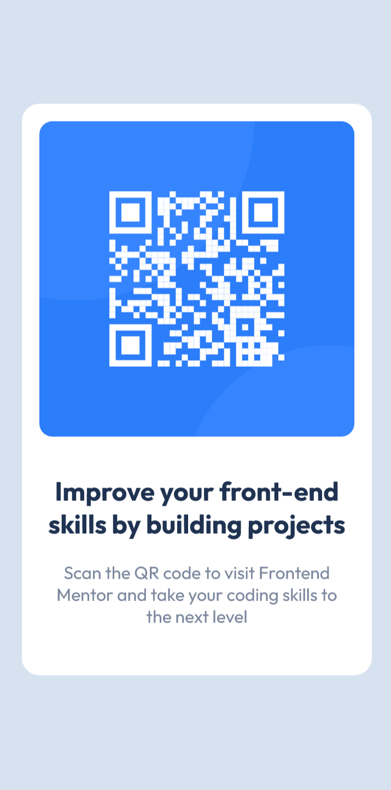
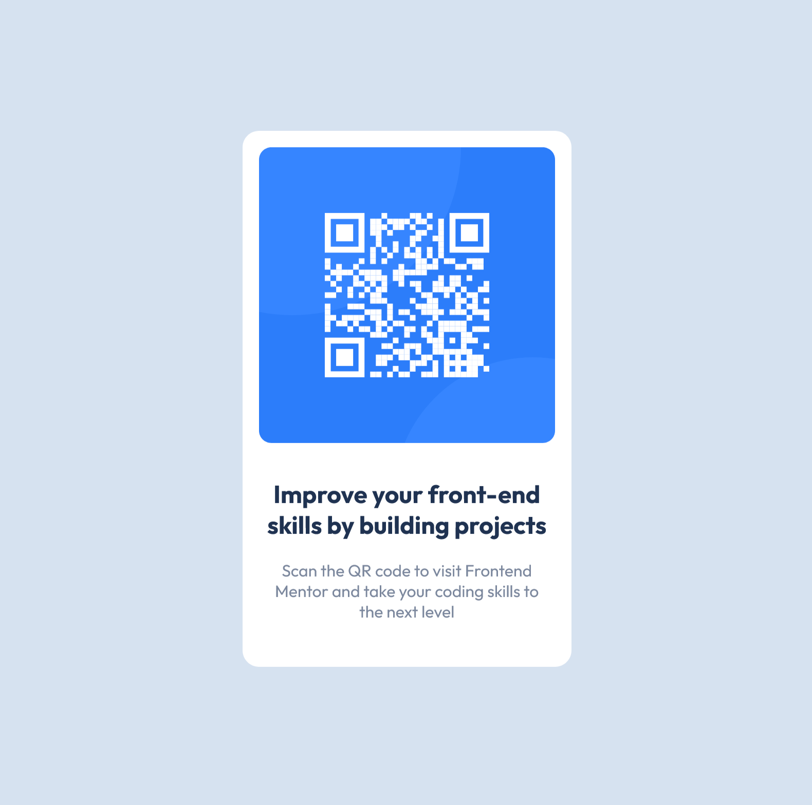

# Frontend Mentor - QR code component solution

This is a solution to the [QR code component challenge on Frontend Mentor](https://www.frontendmentor.io/challenges/qr-code-component-iux_sIO_H). Frontend Mentor challenges help you improve your coding skills by building realistic projects.

## Table of contents

- [Overview](#overview)
  - [Screenshot](#screenshot)
  - [Links](#links)
- [My process](#my-process)
  - [Built with](#built-with)
  - [What I learned](#what-i-learned)
  - [Continued development](#continued-development)
- [Author](#author)

## Overview

### Screenshot

#### Mobile Design

#### Tablet Design

#### Desktop Design

### Links

- Solution URL: [https://github.com/Saurav-98/FEM-N-Qr_Code_Component](https://github.com/Saurav-98/FEM-N-Qr_Code_Component)
- Live Site URL: [https://saurav-qr.netlify.app/](https://saurav-qr.netlify.app/)

## My process

### Built with

- Semantic HTML5 markup
- CSS custom properties
- Mobile-first workflow

### What I learned

In my recent Frontend Mentor challenge, I successfully created a QR Code component using vanilla HTML5, CSS3, and custom properties, while leveraging Figma to analyze design files. This experience enriched my skills in front-end development and design comprehension. By implementing semantic HTML5, I ensured accessibility and SEO-friendliness.

Custom properties in CSS3 provided a flexible and maintainable codebase. Overcoming various challenges, like cross-browser compatibility and responsive design, honed my problem-solving abilities.

### Continued development

I am actively working on mastering the mobile-first responsive design approach, eager to apply it extensively in upcoming Frontend Mentor Challenges. My goal is to gain proficiency in utilizing diverse CSS properties, Semantic HTML, and other cutting-edge frontend technologies through hands-on practice.

## Author

- Website - [https://www.linkedin.com/in/saurav-k-verma/](https://www.linkedin.com/in/saurav-k-verma/)
- Frontend Mentor - [@Saurav-98](https://www.frontendmentor.io/profile/Saurav-98)
- Github - [https://github.com/Saurav-98](https://github.com/Saurav-98)
